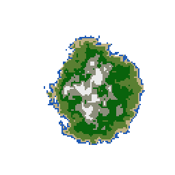
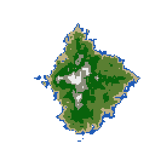
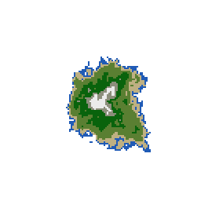
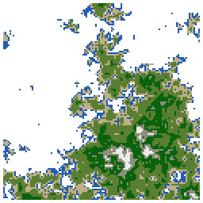
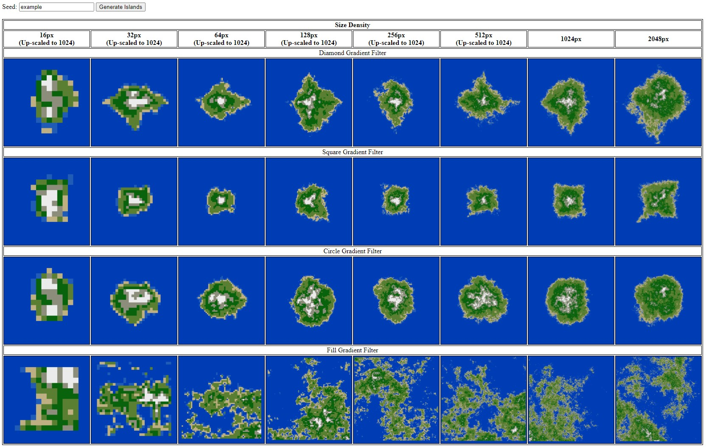

# Island Map Generator in PHP

This is a small project that was done to explore how to generate pixelated island maps.  

Influence for this project comes from an old browser game.

Examples of islands generated using 'example' as seed at 128x128 and upscaling to 256x256:  
  
'example' seed, 128px size, up-scaled to 256, using circle gradient.   
  
'example' seed, 128px size, up-scaled to 256, using diamond gradient.   
  
'example' seed, 128px size, up-scaled to 256, using square gradient.   
  
'example' seed, 128px size, up-scaled to 256, using fill (or none) gradient.   

In the example script used to [render the island](render_island.php), the images will be saved to `islands/` and serve the existing render if it exists to prevent having to re-render the whole image.

---
The interface is very basic as was not the focus of this project.

The blue 'sea' isn't actually in the image, in the image, this layer is transparent. The blue is there as a result of CSS styling. 

---

Do **not** expect maintenance on this, but feel free to make issues/pull requests
